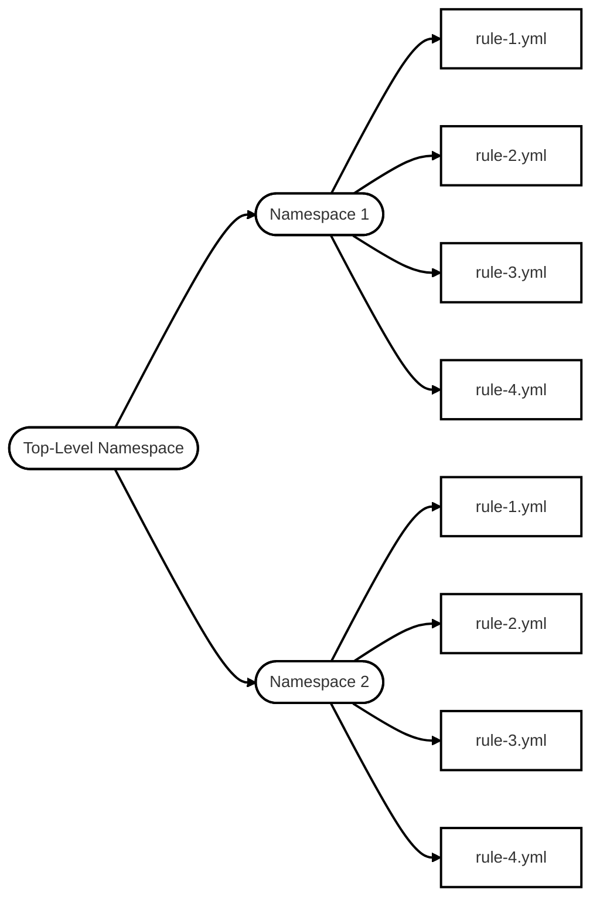

| [Home](../README.md) | [Cyber Security 101](../README.md#cyber-security-101) | **CAPA: The Basics** |

# CAPA: The Basics

## Contents
- [Introduction](#introduction)
- [Tool Overview: How CAPA Works](#tool-overview-how-capa-works)
- [Dissecting CAPA Results Part 1: General Information, MITRE and MAEC](#dissecting-capa-results-part-1-general-information-mitre-and-maec)
- [Dissecting CAPA Results Part 2: Malware Behavior Catalogue](#dissecting-capa-results-part-2-malware-behavior-catalogue)
- [Dissecting CAPA Results Part 3: Namespaces](#dissecting-capa-results-part-3-namespaces)
- [Dissecting CAPA Results Part 4: Capability](#dissecting-capa-results-part-4-capability)
- [More Information, more fun!](#more-information-more-fun)


## 📘Introduction

I've neer heard of CAPA so this one is new to me. 

So **Common Analysis Platform for Artifacts** is a tool that is actually developed by Mandiant.  It allows discovery of capabilites of an executable files. 


## 📘Tool Overview: How CAPA Works


Lets walk through the process step by step.

We should have started th VM in the Introduction, so if not go backm, do that and wait 5 minutes for the VM to start.

Once in double click **Windows PowerShell** on the desktop


The guide tells us that that it may take some time for the prompt to show


The guide also notes we should be in the folder `C:\Users\Administrator\Desktop\capa`, which we are.


Next run the command `capa.exe .\cryptbot.bin`. The guide advises it may take some time to complete


Some arguments whilst we are waiting:
- **`-h`**: Shows us the help
- **`-v`**: Shows verbose result document
- **`-vv`**: Shows very verbose result document

Whilst I'm waiting for the analysis to complete, I downloaded the example file and ran the command `Get-Content .\cryptbot-1726590367927.txt`

Here is the result
```PowerShell
PS C:\Users\UserID\Downloads> Get-Content .\cryptbot-1726590367927.txt
 -----------------------+-------------------------------------------------------------------------------------
¦ md5                    ¦ 3b9d26d2e7433749f2c32edb13a2b0a2                                                   ¦
¦ sha1                   ¦ 969437df8f4ad08542ce8fc9831fc49a7765b7c5                                           ¦
¦ sha256                 ¦ ae7bc6b6f6ecb206a7b957e4bb86e0d11845c5b2d9f7a00a482bef63b567ce4c                   ¦
¦ analysis               ¦ static                                                                             ¦
¦ os                     ¦ windows                                                                            ¦
¦ format                 ¦ pe                                                                                 ¦
¦ arch                   ¦ i386                                                                               ¦
¦ path                   ¦ C:\Users\Administrator\Desktop\capa                                                ¦
 ------------------------+------------------------------------------------------------------------------------

 ------------------------+------------------------------------------------------------------------------------
¦ ATT&CK Tactic          ¦ ATT&CK Technique                                                                   ¦
 ------------------------+------------------------------------------------------------------------------------
¦ DEFENSE EVASION        ¦ Obfuscated Files or Information T1027                                              ¦
¦                        ¦ Obfuscated Files or Information::Indicator Removal from Tools T1027.005            ¦
¦                        ¦ Virtualization/Sandbox Evasion::System Checks T1497.001                            ¦
+------------------------+------------------------------------------------------------------------------------¦
¦ DISCOVERY              ¦ File and Directory Discovery T1083                                                 ¦
+------------------------+------------------------------------------------------------------------------------¦
¦ EXECUTION              ¦ Command and Scripting Interpreter::PowerShell T1059.001                            ¦
¦                        ¦ Shared Modules T1129                                                               ¦
+------------------------+------------------------------------------------------------------------------------¦
¦ IMPACT                 ¦ Resource Hijacking T1496                                                           ¦
+------------------------+------------------------------------------------------------------------------------¦
¦ PERSISTENCE            ¦ Scheduled Task/Job::At T1053.002                                                   ¦
¦                        ¦ Scheduled Task/Job::Scheduled Task T1053.005                                       ¦
 ------------------------+------------------------------------------------------------------------------------

 ------------------------+------------------------------------------------------------------------------------
¦ MAEC Category               ¦ MAEC Value                                                                    ¦
 ------------------------+------------------------------------------------------------------------------------
¦ malware-category            ¦ launcher                                                                      ¦
 ------------------------+------------------------------------------------------------------------------------

 ------------------------+------------------------------------------------------------------------------------
¦ MBC Objective               ¦ MBC Behavior                                                                  ¦
 ------------------------+------------------------------------------------------------------------------------
¦ ANTI-BEHAVIORAL ANALYSIS    ¦ Virtual Machine Detection [B0009]                                             ¦
+-----------------------------+-------------------------------------------------------------------------------¦
¦ ANTI-STATIC ANALYSIS        ¦ Executable Code Obfuscation::Argument Obfuscation [B0032.020]                 ¦
¦                             ¦ Executable Code Obfuscation::Stack Strings [B0032.017]                        ¦
+-----------------------------+-------------------------------------------------------------------------------¦
¦ COMMUNICATION               ¦ HTTP Communication [C0002]                                                    ¦
¦                             ¦ HTTP Communication::Read Header [C0002.014]                                   ¦
+-----------------------------+-------------------------------------------------------------------------------¦
¦ DATA                        ¦ Check String [C0019]                                                          ¦
¦                             ¦ Encode Data::Base64 [C0026.001]                                               ¦
¦                             ¦ Encode Data::XOR [C0026.002]                                                  ¦
+-----------------------------+-------------------------------------------------------------------------------¦
¦ DEFENSE EVASION             ¦ Obfuscated Files or Information::Encoding-Standard Algorithm [E1027.m02]      ¦
+-----------------------------+-------------------------------------------------------------------------------¦
¦ DISCOVERY                   ¦ File and Directory Discovery [E1083]                                          ¦
+-----------------------------+-------------------------------------------------------------------------------¦
¦ EXECUTION                   ¦ Command and Scripting Interpreter [E1059]                                     ¦
+-----------------------------+-------------------------------------------------------------------------------¦
¦ FILE SYSTEM                 ¦ Create Directory [C0046]                                                      ¦
¦                             ¦ Delete File [C0047]                                                           ¦
¦                             ¦ Read File [C0051]                                                             ¦
¦                             ¦ Writes File [C0052]                                                           ¦
+-----------------------------+-------------------------------------------------------------------------------¦
¦ MEMORY                      ¦ Allocate Memory [C0007]                                                       ¦
+-----------------------------+-------------------------------------------------------------------------------¦
¦ PROCESS                     ¦ Create Process [C0017]                                                        ¦
 ------------------------+------------------------------------------------------------------------------------

 ------------------------+------------------------------------------------------------------------------------
¦ Capability                                           ¦ Namespace                                            ¦
 ------------------------+------------------------------------------------------------------------------------
¦ reference anti-VM strings                            ¦ anti-analysis/anti-vm/vm-detection                   ¦
¦ reference anti-VM strings targeting VMWare           ¦ anti-analysis/anti-vm/vm-detection                   ¦
¦ reference anti-VM strings targeting VirtualBox       ¦ anti-analysis/anti-vm/vm-detection                   ¦
¦ contain obfuscated stackstrings (2 matches)          ¦ anti-analysis/obfuscation/string/stackstring         ¦
¦ reference HTTP User-Agent string                     ¦ communication/http                                   ¦
¦ check HTTP status code                               ¦ communication/http/client                            ¦
¦ reference Base64 string                              ¦ data-manipulation/encoding/base64                    ¦
¦ encode data using XOR                                ¦ data-manipulation/encoding/xor                       ¦
¦ contain a thread local storage (.tls) section        ¦ executable/pe/section/tls                            ¦
¦ get common file path                                 ¦ host-interaction/file-system                         ¦
¦ create directory                                     ¦ host-interaction/file-system/create                  ¦
¦ delete file                                          ¦ host-interaction/file-system/delete                  ¦
¦ read file on Windows (4 matches)                     ¦ host-interaction/file-system/read                    ¦
¦ write file on Windows (5 matches)                    ¦ host-interaction/file-system/write                   ¦
¦ get thread local storage value                       ¦ host-interaction/process                             ¦
¦ create process on Windows                            ¦ host-interaction/process/create                      ¦
¦ allocate or change RWX memory                        ¦ host-interaction/process/inject                      ¦
¦ reference cryptocurrency strings                     ¦ impact/cryptocurrency                                ¦
¦ link function at runtime on Windows (5 matches)      ¦ linking/runtime-linking                              ¦
¦ parse PE header (4 matches)                          ¦ load-code/pe                                         ¦
¦ resolve function by parsing PE exports (186 matches) ¦ load-code/pe                                         ¦
¦ run PowerShell expression                            ¦ load-code/powershell/                                ¦
¦ schedule task via at                                 ¦ persistence/scheduled-tasks                          ¦
¦ schedule task via schtasks                           ¦ persistence/scheduled-tasks                          ¦
 ------------------------+------------------------------------------------------------------------------------
```


### ❓ Question 1

> What command-line option would you use if you need to check what other parameters you can use with the tool? Use the shortest format.

#### 🧪 Process

If I wasn't clear on what options are available for any commandline tool I would issue `/?`, `-h`, `--help` or some other variation. However in this instance, we know its `-h`.

Trying this as the answer

#### ✅ Answer

- `-h` ✅


### ❓ Question 2

What command-line options are used to find detailed information on the malware's capabilities? Use the shortest format.

#### 🧪 Process

The shortest format was just `-v` for verbose report document.

Trying this as the answer

#### ✅ Answer

- `-v` ✅


### ❓ Question 3

> What command-line options do you use to find very verbose information about the malware's capabilities? Use the shortest format.

#### 🧪 Process

Very verbose would be `-vv`.

Trying this as the answer

#### ✅ Answer

- `-vv` ✅


### ❓ Question 4

> What PowerShell command will you use to read the content of a file?

#### 🧪 Process

On of my favorites `cat`. Only joking, `Get-Content`.

Trying this as the answer

#### ✅ Answer

- `Get-Content` ✅


## 📘Dissecting CAPA Results Part 1: General Information, MITRE and MAEC

In this section, we pull the report apart and discuss it.

### Basic information

Here we can see the hashes (**md5**, **sha1**, and **sha256**) and the type of **analysis**, the **OS**, the binary **format**, **arch**itecture and finally the **path** of the binary
```text
 -----------------------+-------------------------------------------------------------------------------------
¦ md5                    ¦ 3b9d26d2e7433749f2c32edb13a2b0a2                                                   ¦
¦ sha1                   ¦ 969437df8f4ad08542ce8fc9831fc49a7765b7c5                                           ¦
¦ sha256                 ¦ ae7bc6b6f6ecb206a7b957e4bb86e0d11845c5b2d9f7a00a482bef63b567ce4c                   ¦
¦ analysis               ¦ static                                                                             ¦
¦ os                     ¦ windows                                                                            ¦
¦ format                 ¦ pe                                                                                 ¦
¦ arch                   ¦ i386                                                                               ¦
¦ path                   ¦ C:\Users\Administrator\Desktop\capa                                                ¦
 ------------------------+------------------------------------------------------------------------------------
```
### MITRE ATT&CK

MITRE is just the company, not an acronym whilst `ATT&CT` stands for **Adversarial Tactics, Techniques, and Common Knowledge**.

The ATT&CK framework is a representation of global knowledge that is documented tatics and techniques that is deployed by treat actors at each stage of an attack. 

Below we can see 

```text
 ------------------------+------------------------------------------------------------------------------------
¦ ATT&CK Tactic          ¦ ATT&CK Technique                                                                   ¦
 ------------------------+------------------------------------------------------------------------------------
¦ DEFENSE EVASION        ¦ Obfuscated Files or Information T1027                                              ¦
¦                        ¦ Obfuscated Files or Information::Indicator Removal from Tools T1027.005            ¦
¦                        ¦ Virtualization/Sandbox Evasion::System Checks T1497.001                            ¦
+------------------------+------------------------------------------------------------------------------------¦
¦ DISCOVERY              ¦ File and Directory Discovery T1083                                                 ¦
+------------------------+------------------------------------------------------------------------------------¦
¦ EXECUTION              ¦ Command and Scripting Interpreter::PowerShell T1059.001                            ¦
¦                        ¦ Shared Modules T1129                                                               ¦
+------------------------+------------------------------------------------------------------------------------¦
¦ IMPACT                 ¦ Resource Hijacking T1496                                                           ¦
+------------------------+------------------------------------------------------------------------------------¦
¦ PERSISTENCE            ¦ Scheduled Task/Job::At T1053.002                                                   ¦
¦                        ¦ Scheduled Task/Job::Scheduled Task T1053.005                                       ¦
 ------------------------+------------------------------------------------------------------------------------
```

The tactic can be used to filter the technique.

So for example **`EXECUTION`** → **`Command and Scripting Interpreter`** [[T1059](https://attack.mitre.org/techniques/T1059/)]


Can lead us to **`PowerShell`** [[001](https://attack.mitre.org/techniques/T1059/001/)]


### MAEC

MAEC stands for **Malware Attribute Enumeration and Characterization**. It's a way of describing how the malware behaves.

```text
 ------------------------+------------------------------------------------------------------------------------
¦ MAEC Category               ¦ MAEC Value                                                                    ¦
 ------------------------+------------------------------------------------------------------------------------
¦ malware-category            ¦ launcher                                                                      ¦
 ------------------------+------------------------------------------------------------------------------------
```
CAPA has catagorised this as `launcher`. SO it is anticipated that it may:
- Dropping additional payloads
- Activating persistence mechanisms
- Connecting to command-and-control (C2) servers
- Executing specific functions

Useful links:
- [Malware Behavior Catalog](https://github.com/MBCProject/mbc-markdown)
- [Malware Behavior Catalog Matrix](https://maecproject.github.io/ema/)
    - [MAEC Core Specification, Version 5.0](https://maecproject.github.io/releases/5.0/MAEC_Core_Specification.pdf)
    - [MAEC Vocabularies Specification, Version 5.0
](https://maecproject.github.io/releases/5.0/MAEC_Vocabularies_Specification.pdf)


### ❓ Question 1

> What is the sha256 of cryptbot.bin?

#### 🧪 Process

We can find this in our basic information

```text
│ sha256      │ ae7bc6b6f6ecb206a7b957e4bb86e0d11845c5b2d9f7a00a482bef63b567ce4c                   │
```
Result = `ae7bc6b6f6ecb206a7b957e4bb86e0d11845c5b2d9f7a00a482bef63b567ce4c`

Trying this as the answer

#### ✅ Answer

- `ae7bc6b6f6ecb206a7b957e4bb86e0d11845c5b2d9f7a00a482bef63b567ce4c` ✅


### ❓ Question 2

> What is the **Technique** Identifier of **Obfuscated Files or Information**?

#### 🧪 Process

Visit the [MITRE ATT&CK](https://attack.mitre.org/) site and look under **Defense Evasion**.

Scroll down and find **Obfuscated Files or Information**. 

Here we can find information on _Obfuscated Files or Information_.


As we can see from the above screenshot the ID is `T1027`. 

Trying this as the answer

#### ✅ Answer

- `T1027` ✅


### ❓ Question 3

> What is the **Sub-Technique** Identifier of **Obfuscated Files or Information::Indicator Removal from Tools**?

#### 🧪 Process

Since we're already in the correct page, we need to find _Indicator Removal from Tools_ and click


Now we can see the Technique and sub technique ID. 


Our result is `T1027.005`

Trying this as the answer

#### ✅ Answer

- `T1027.005` ✅


### ❓ Question 4

> When CAPA tags a file with this MAEC value, it indicates that it demonstrates behaviour similar to, but not limited to, **Activating persistence mechanisms**?


#### 🧪 Process

The event `Activating persistence mechanisms` is under `launcher`

Trying this as the answer

#### ✅ Answer

- `launcher` ✅


### ❓ Question 5

> When CAPA tags a file with this MAEC value, it indicates that the file demonstrates behaviour similar to, but not limited to, **Fetching additional payloads or resources from the internet**?

#### 🧪 Process

`Fetching additional payloads` would fall under `Downloader`

Trying this as the answer

#### ✅ Answer

- `Downloader` ✅


## 📘Dissecting CAPA Results Part 2: Malware Behavior Catalogue

Here we have the next block

```text
 ------------------------+------------------------------------------------------------------------------------
¦ MBC Objective               ¦ MBC Behavior                                                                  ¦
 ------------------------+------------------------------------------------------------------------------------
¦ ANTI-BEHAVIORAL ANALYSIS    ¦ Virtual Machine Detection [B0009]                                             ¦
+-----------------------------+-------------------------------------------------------------------------------¦
¦ ANTI-STATIC ANALYSIS        ¦ Executable Code Obfuscation::Argument Obfuscation [B0032.020]                 ¦
¦                             ¦ Executable Code Obfuscation::Stack Strings [B0032.017]                        ¦
+-----------------------------+-------------------------------------------------------------------------------¦
¦ COMMUNICATION               ¦ HTTP Communication [C0002]                                                    ¦
¦                             ¦ HTTP Communication::Read Header [C0002.014]                                   ¦
+-----------------------------+-------------------------------------------------------------------------------¦
¦ DATA                        ¦ Check String [C0019]                                                          ¦
¦                             ¦ Encode Data::Base64 [C0026.001]                                               ¦
¦                             ¦ Encode Data::XOR [C0026.002]                                                  ¦
+-----------------------------+-------------------------------------------------------------------------------¦
¦ DEFENSE EVASION             ¦ Obfuscated Files or Information::Encoding-Standard Algorithm [E1027.m02]      ¦
+-----------------------------+-------------------------------------------------------------------------------¦
¦ DISCOVERY                   ¦ File and Directory Discovery [E1083]                                          ¦
+-----------------------------+-------------------------------------------------------------------------------¦
¦ EXECUTION                   ¦ Command and Scripting Interpreter [E1059]                                     ¦
+-----------------------------+-------------------------------------------------------------------------------¦
¦ FILE SYSTEM                 ¦ Create Directory [C0046]                                                      ¦
¦                             ¦ Delete File [C0047]                                                           ¦
¦                             ¦ Read File [C0051]                                                             ¦
¦                             ¦ Writes File [C0052]                                                           ¦
+-----------------------------+-------------------------------------------------------------------------------¦
¦ MEMORY                      ¦ Allocate Memory [C0007]                                                       ¦
+-----------------------------+-------------------------------------------------------------------------------¦
¦ PROCESS                     ¦ Create Process [C0017]                                                        ¦
 ------------------------+------------------------------------------------------------------------------------
```

### Malware Behavior Catalogue (MBC)

The MBC is like a library of malware behaviours. I it can describe behaviours and report findings in a standardised way. Often ties in with the MITRE **ATT&CK** framework, but not a copy. 

**Reference**: [Malware Behavior Catalog v3.1](https://github.com/MBCProject/mbc-markdown)

### Objective

**See**: [Malware Objectives](https://github.com/MBCProject/mbc-markdown/blob/main/mbc_summary.md#malware-objectives)

MBC malware objectives are based on MITRE ATT&CK tactics but tailored for malware analysis. It also adds two unique objectives not found in ATT&CK: Anti-Behavioral Analysis and Anti-Static Analysis, which focus on evading analysis techniques.


### Micro-Objective

MBC includes micro-behaviors that are low-level actions like creating sockets or checking strings. Often aren't malicious but commonly appear in malware and support higher-level objectives almost like signatures.


### MBC Behaviors

**See**: [Malware Behaviors](https://github.com/MBCProject/mbc-markdown/blob/main/mbc_summary.md#malware-behaviors)

MBC lists behaviors under each objective, linking to MITRE ATT&CK where relevant but not duplicating its content. The behavior names may differ, and MBC is meant to complement ATT&CK by adding extra detail specific to malware analysis.


### Micro-Behavior

**See**: [Malware Micro-behaviors](https://github.com/MBCProject/mbc-markdown/blob/main/mbc_summary.md#malware-micro-behaviors)

MBC captures low-level behaviors such as creating sockets or checking strings that aren't always malicious but are commonly seen in malware and support broader objectives.


### Methods

Methods in MBC are tied to behaviors, they either refine the behavior or show how it’s implemented. They’re similar to ATT&CK sub-techniques, but a method can’t exist on its own without being linked to a behavior.


### ❓ Question 1

> What serves as a catalogue of malware objectives and behaviours?

#### 🧪 Process

The `Malware Behavior Catalog`,

Trying this as the answer

#### ✅ Answer

- `Malware Behavior Catalogue` ✅

_**Note:** the spelling difference of `Catalog` and `Catalogue`._


### ❓ Question 2

>  Which field is based on ATT&CK tactics in the context of malware behaviour?

#### 🧪 Process

> _`objectives` are based on MITRE ATT&CK tactics_

Trying this as the answer

#### ✅ Answer

- `objectives` ✅


### ❓ Question 3

> What is the Identifier of "**Create Process**" micro-behavior?

#### 🧪 Process

Navigate to [#malware-micro-behaviors](https://github.com/MBCProject/mbc-markdown/blob/main/mbc_summary.md#malware-micro-behaviors)
Scroll down to **create process**


Noice the identifyer of `C0017`. 

Trying this as the answer

#### ✅ Answer

- `C0017` ✅


### ❓ Question 4

> What is the behaviour with an Identifier of **B0009**?

#### 🧪 Process

Navigate to [MBC Summary](https://github.com/MBCProject/mbc-markdown/blob/main/mbc_summary.md)
Perform a search for `B0009`


This is not the result you are looking for. Hit **F3** to find the next result


This is the result we are looking for (`Virtual Machine Detection`)

Trying this as the answer

#### ✅ Answer

- `Virtual Machine Detection`✅


### ❓ Question 5

> Malware can be used to obfuscate data using base64 and XOR. What is the related **micro-behavior** for this?

#### 🧪 Process

Navigate to [#malware-micro-behaviors](https://github.com/MBCProject/mbc-markdown/blob/main/mbc_summary.md#malware-micro-behaviors

If I remember correctly that was "Encode Data". Lets see if that is there, Press **F3** to search and type "Encode Data" followed by enter.


Great, that is just the one result, so probably on the right track, let's validate by clicking on the [`Encode Data`](https://github.com/MBCProject/mbc-markdown/blob/main/micro-behaviors/data/encode-data.md) link


Perfect, it looks like `Encode Data` is what we're after

Trying this as the answer

#### ✅ Answer

- `Encode Data` ✅


### ❓ Question 6

> Which micro-behavior refers to "**Malware is capable of initiating HTTP communications**"?

#### 🧪 Process

Again, let's Navigate to [#malware-micro-behaviors](https://github.com/MBCProject/mbc-markdown/blob/main/mbc_summary.md#malware-micro-behaviors)

I'm not 100% sure, but lets hit **F3** and type "HTTP comm" followed by return to find the first result.


Again, there is just the one result. I would be fairly confident in using this as the answer, however lets click that [`HTTP Communication`](https://github.com/MBCProject/mbc-markdown/blob/main/micro-behaviors/communication/http-communication.md) link and validate.


I won't go over everything here butterms such as "_connects to HTTP server_", "_creates request_", "_downloads URL to file_" all indicate HTTP communications initiated by the malware if desired.

The micro-behaviour in question looks to be `HTTP Communication`.

Trying this as the answer

#### ✅ Answer

- `HTTP Communication` ✅


## 📘Dissecting CAPA Results Part 3: Namespaces

Below is the final section of the report

```text
 ------------------------+------------------------------------------------------------------------------------
¦ Capability                                           ¦ Namespace                                            ¦
 ------------------------+------------------------------------------------------------------------------------
¦ reference anti-VM strings                            ¦ **anti-analysis/anti-vm/vm-detection****                   ¦
¦ reference anti-VM strings targeting VMWare           ¦ **anti-analysis/anti-vm/vm-detection**                   ¦
¦ reference anti-VM strings targeting VirtualBox       ¦ **anti-analysis/anti-vm/vm-detection**                   ¦
¦ contain obfuscated stackstrings (2 matches)          ¦ **anti-analysis/obfuscation/string/stackstring**         ¦
¦ reference HTTP User-Agent string                     ¦ **communication/http                                   **¦
¦ check HTTP status code                               ¦ **communication/http/client                            **¦
¦ reference Base64 string                              ¦ **data-manipulation/encoding/base64                    **¦
¦ encode data using XOR                                ¦ **data-manipulation/encoding/xor**                       ¦
¦ contain a thread local storage (.tls) section        ¦ **executable/pe/section/tls**                            ¦
¦ get common file path                                 ¦ **host-interaction/file-system**                         ¦
¦ create directory                                     ¦ **host-interaction/file-system/create**                  ¦
¦ delete file                                          ¦ host-interaction/file-system/delete                  ¦
¦ read file on Windows (4 matches)                     ¦ host-interaction/file-system/read                    ¦
¦ write file on Windows (5 matches)                    ¦ host-interaction/file-system/write                   ¦
¦ get thread local storage value                       ¦ host-interaction/process                             ¦
¦ create process on Windows                            ¦ host-interaction/process/create                      ¦
¦ allocate or change RWX memory                        ¦ host-interaction/process/inject                      ¦
¦ reference cryptocurrency strings                     ¦ impact/cryptocurrency                                ¦
¦ link function at runtime on Windows (5 matches)      ¦ linking/runtime-linking                              ¦
¦ parse PE header (4 matches)                          ¦ load-code/pe                                         ¦
¦ resolve function by parsing PE exports (186 matches) ¦ load-code/pe                                         ¦
¦ run PowerShell expression                            ¦ load-code/powershell/                                ¦
¦ schedule task via at                                 ¦ persistence/scheduled-tasks                          ¦
¦ schedule task via schtasks                           ¦ persistence/scheduled-tasks                          ¦
 ------------------------+------------------------------------------------------------------------------------
```

This section focuses on the Namespaces.

### Namespaces



A list of the namespaces can be found [CAPA GitHub](https://github.com/mandiant/capa-rules?tab=readme-ov-file#namespace-organization).

#### Top level namespaces

|                                         Namespace                                         |                              Short description                              |
|-------------------------------------------------------------------------------------------|-----------------------------------------------------------------------------|
| [anti-analysis](https://github.com/mandiant/capa-rules/blob/master/anti-analysis)         | packing, obfuscation, anti-X, etc.                                          |
| [collection](https://github.com/mandiant/capa-rules/blob/master/collection)               | data that may be enumerated and collected for exfiltration                  |
| [communication](https://github.com/mandiant/capa-rules/blob/master/communication)         | HTTP, TCP, command and control (C2) traffic, etc.                           |
| [compiler](https://github.com/mandiant/capa-rules/blob/master/compiler)                   | detection of build environments, such as MSVC, Delphi, or AutoIT            |
| [data-manipulation](https://github.com/mandiant/capa-rules/blob/master/data-manipulation) | encryption, hashing, etc.                                                   |

### Namespaces

|                                         Namespace                                         |                              Short description                              |
|-------------------------------------------------------------------------------------------|-----------------------------------------------------------------------------|
| [executable](https://github.com/mandiant/capa-rules/blob/master/executable)               | characteristics of the executable, such as PE sections or debug info        |
| [host-interaction](https://github.com/mandiant/capa-rules/blob/master/host-interaction)   | access or manipulation of system resources, like processes or the Registry  |
| [impact](https://github.com/mandiant/capa-rules/blob/master/impact)                       | end goal                                                                    |
| [internal](https://github.com/mandiant/capa-rules/blob/master/internal)                   | used internally by capa to guide analysis                                   |
| [lib](https://github.com/mandiant/capa-rules/blob/master/lib)                             | building blocks to create other rules                                       |
| [linking](https://github.com/mandiant/capa-rules/blob/master/linking)                     | detection of dependencies, such as OpenSSL or Zlib                          |
| [load-code](https://github.com/mandiant/capa-rules/blob/master/load-code)                 | runtime load and execution of code, such as embedded PE or shellcode        |
| [malware-family](https://github.com/mandiant/capa-rules/blob/master/malware-family)       | detection of malware families                                               |
| [nursery](https://github.com/mandiant/capa-rules/blob/master/nursery)                     | staging ground for rules that are not quite polished                        |
| [persistence](https://github.com/mandiant/capa-rules/blob/master/persistence)             | all sorts of ways to maintain access                                        |
| [runtime](https://github.com/mandiant/capa-rules/blob/master/runtime)                     | detection of language runtimes, such as the .NET platform or Go             |
| [targeting](https://github.com/mandiant/capa-rules/blob/master/targeting)                 | special handling of systems, such as ATM machines                           |


### ❓ Question 1

> Which top-level Namespace contains a set of rules specifically designed to detect behaviours, including obfuscation, packing, and anti-debugging techniques **exhibited by malware to evade analysis**?

#### 🧪 Process

As per the namespace short description we have anti-analysis (packing, obfuscation, anti-X, etc.).

Lets navigate to [`anti-analysis`](https://github.com/mandiant/capa-rules/blob/master/anti-analysis)


Result, we have all three of the mentioned rules.

Trying this as the answer

#### ✅ Answer

- `Anti-Analysis` ✅


### ❓ Question 2

> Which namespace contains rules to **detect virtual machine (VM) environments**? Note that this is not the TLN or Top-Level Namespace.

#### 🧪 Process

I did notice that actually, within `anti-analysis there was **`anti-vm/vm-detection`**. 

Trying this as the answer

#### ✅ Answer

- `anti-vm/vm-detection` ✅


### ❓ Question 3

> Which Top-Level Namespace contains rules related to **behaviours associated with maintaining access or persistence within a compromised system**? This namespace is focused on understanding how malware can establish and maintain a presence within a compromised environment, allowing it to persist and carry out malicious activities over an extended period.

#### 🧪 Process

Navigate to [Namespace Organization](https://github.com/mandiant/capa-rules/tree/master#namespace-organization)

Since we are looking at maintaining a foothold, or persistence. It stands to reason it would be `persistence`.


Trying this as the answer

#### ✅ Answer

- `persistence` ✅


### ❓ Question 4

> Which namespace addresses techniques such as **String Encryption, Code Obfuscation, Packing, and Anti-Debugging Tricks**, which conceal or obscure the true purpose of the code?

#### 🧪 Process

Navigate to [Namespace Organization](https://github.com/mandiant/capa-rules/tree/master#namespace-organization)


Straight away we see that [`anti-analysis`](https://github.com/mandiant/capa-rules/tree/master/anti-analysis) mentions `obfuscation`

Trying this as the answer

#### ✅ Answer

- `obfuscation` ✅


### ❓ Question 5

> Which Top-Level Namespace Is a **staging ground** for rules that are not quite polished?

#### 🧪 Process

Navigate to [Namespace Organization](https://github.com/mandiant/capa-rules/tree/master#namespace-organization)


Say no more,

Trying this as the answer

#### ✅ Answer

- `nursery` ✅


## 📘Dissecting CAPA Results Part 4: Capability

### ❓ Question 1

> What **rule yaml file** was matched if the Capability or rule name is **check HTTP status code**?

#### 🧪 Process


#### ✅ Answer

- `check-http-status-code.yml` ✅


### ❓ Question 2

> What is the **name of the Capability** if the rule YAML file is `reference-anti-vm-strings.yml`?

#### 🧪 Process

Navigate to [`reference-anti-vm-strings.yml`](https://github.com/mandiant/capa-rules/blob/master/anti-analysis/anti-vm/vm-detection/reference-anti-vm-strings.yml)


**Name:**: `reference anti-VM strings`

Trying this as the answer

#### ✅ Answer

- `reference anti-VM strings` ✅


### ❓ Question 3

> Which **TLN** or Top-Level Namespace includes the Capability or rule name **run PowerShell expression**?

#### 🧪 Process

In the end I did a search for powershell and found the following link

[run-powershell-expression.yml](https://github.com/mandiant/capa-rules/blob/master/load-code/powershell/run-powershell-expression.yml).

In here we can see that namespace is `load-code/powershell/` so the tln will be `load-code`

Trying this as the answer

#### ✅ Answer

- `load-code` ✅


### ❓ Question 4

> Check the conditions inside the `check-for-windows-sandbox-via-registry.yml` rule file from this [link](https://github.com/MBCProject/capa-rules-1/blob/master/anti-analysis/anti-vm/vm-detection/check-for-windows-sandbox-via-registry.yml). What is the **value of the API** that ends in `Ex` is it looking for?

#### 🧪 Process


- **api**: `RegOpenKeyEx`

Trying this as the answer


#### ✅ Answer

- `RegOpenKeyEx` ✅


## 📘More Information, more fun!

### ❓ Question 1

> Which parameter allows you to output the result of CAPA into a .json file?

#### 🧪 Process

- `-j`

Trying this as the answer

#### ✅ Answer

- `-j` ✅

Trying this as the answer

### ❓ Question 2

> What tool allows you to interactively explore CAPA results in your web browser?

#### 🧪 Process

- `capa Explorer Web`

Trying this as the answer

#### ✅ Answer

- `CAPA Web Explorer` ✅


### ❓ Question 3

> Which feature of this CAPA Web Explorer allows you to filter options or results?

#### 🧪 Process

- `Global Search Box`

Trying this as the answer

#### ✅ Answer

- `Global Search Box` ✅
